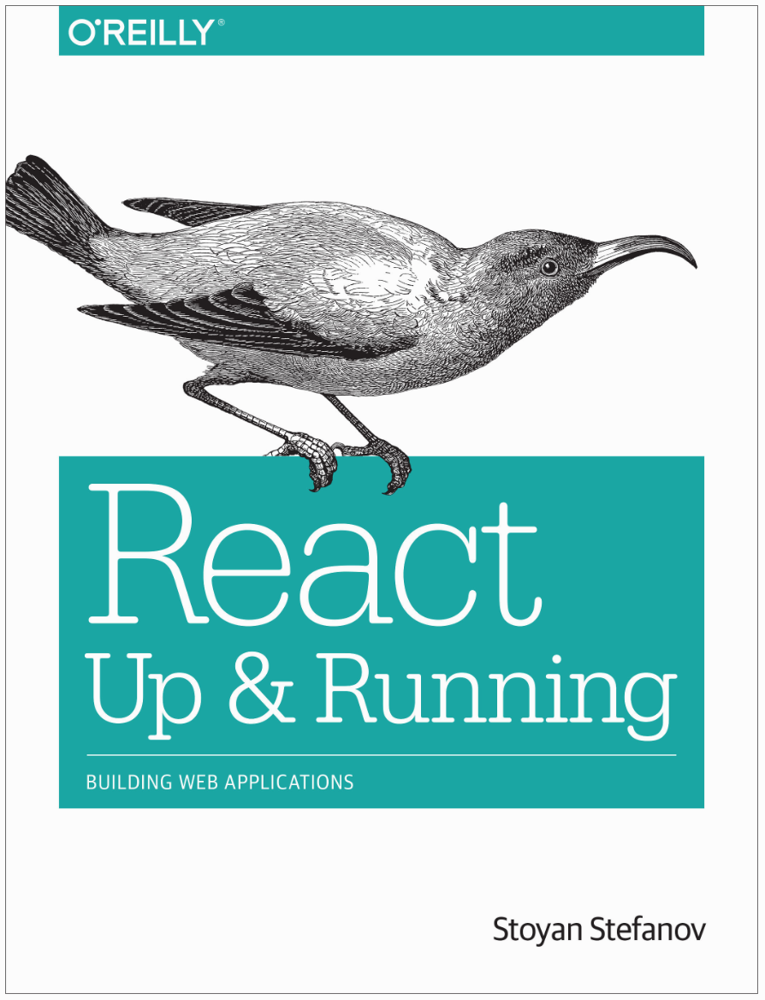

# React: Up & Running, Building Web Applications

[Репозиторий](https://github.com/stoyan/reactbook) с кодом из книги.

Реакт — фреймворк для разработки интерфейсов. Следим за состоянием приложения и реагируем на его изменение.

Используется на вебе, в нативных мобильных и десктопных интерфейсах, в VR. Не в смысле один код для всех, а один подход для всех. Научились Реакту, можем делать интерфейсы для разных платформ в этом ключе.

> To cut a long story short: learn React, take 80% of your time back, and focus on the stuff that matters (like the real reason your app exists).

_JSX — отдельная и необязательная технология_. Просто часто используется с Реактом.